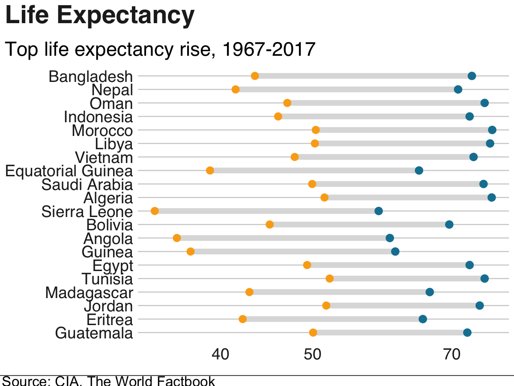

# Life Expectancy Graphs

 Life Expectancy by Country in Graphs. The most change in the life expectancy is shown in Asian countries over the last 50 years:
 
 

Over the last 10 years, though, the life expectancy has changed the most in African countries:

## How to Use

The `make.Life-Expectancy-Table` generates the data table and relabels the countries. Then, use `Life-Expectancy-Graph` to generate the graphs, which are based on the BBC graphing library.